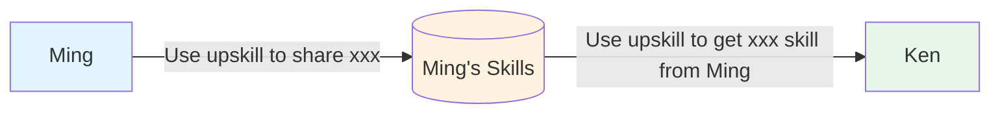
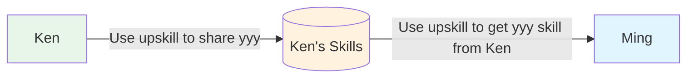

# Up Skill

Up skill non-tech people so that teams can make use of AI skills to improve their work experience. 
This skill encourages you to build your network for sharing skills and your teammates' superpower.

## To the Devs

> Your skill is only useful if you can share it

## For Human Readers

- Usage: [usage.md](usage.md) - the phrases to say in your AI tool (e.g. "use upskill to share `<skill-name>`")
- Install: [.install/README.md](.install/README.md) - how installation works
