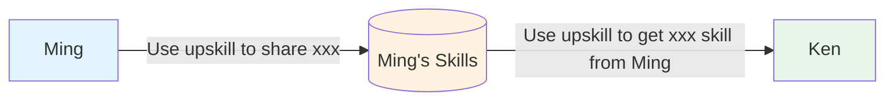
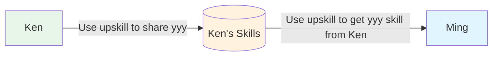

# Up Skill

Up skill **non-tech people** so that teams can make use of AI skills to improve their work experience.

## Goal

> Make Skills easy to share.
> Encourages you to build your **network** for **sharing skills** and equipt your teammates' superpower.

## To the Devs

> Your skills are **not useful** if they can't be shared

## For Human Readers

- Usage: [usage.md](usage.md) - the phrases to say in your AI tool (e.g. "use upskill to share `<skill-name>`")
- Install: `https://raw.githubusercontent.com/mingzilla/upskill/main/.install/install/install__starter.md`
- Uninstall: `https://raw.githubusercontent.com/mingzilla/upskill/main/.install/uninstall/action__uninstall.md`