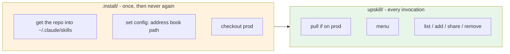

# upskill - concept inventory

Checklist for the re-implementation: everything the current version does, split by whether the user
still cares about it once the skill sits in `~/.claude/skills/upskill`.

## Split



```text
~/.claude/skills/upskill/          <- the git repo itself
├── SKILL.md                       usage entry point
├── concepts.md                    this file
├── usage.md
├── upskill__user_config.json      per-machine, gitignored
├── upskill__user_config.example.json
├── scripts/                       launcher + shared lib
├── actions/                       one folder per verb
└── .install/                      installation only - user never opens it
```

## 1. Entities

| Concept | Today | Re-implement as |
|---|---|---|
| workspace | `.upskill__workspace/` holding config + every clone | **gone** - the skill repo is the only anchor |
| user config | `{user, team, address_book}` in the workspace | `{address_book}` in the skill repo, gitignored |
| address book | cloned git repo containing `address_book.json` | a single `.json` file path |
| member | key in `users{}` -> `{folder, repo}` | unchanged |
| team | `team__<name>` dir grouping a book + member clones | **gone?** - decide (see §5) |
| skills repo | per-member git repo of shared skills | unchanged - still cloned on demand |
| skill | any folder containing `SKILL.md` | unchanged |
| agent root | `~/.claude/skills` and `~/.codex/skills` | unchanged - both still targets |
| project scope | `--project current` or `--project <path>` | unchanged - no user-level target |
| launcher | `scripts/upskill__run <action>` | unchanged + pulls before dispatch |
| shell pair | every script ships `.sh` + `.ps1` | unchanged - pick by OS, never probe |

## 2. Runtime verbs - stay in `upskill/`

| Verb | Call | Does | Status |
|---|---|---|---|
| menu | `<upskill> menu` | print home screen verbatim | keep |
| list | `<upskill> list <owner>` | numbered list of a member's skills | keep |
| add | `<upskill> add <owner> <skill> --project <scope>` | copy skill into a project | keep |
| share | `<upskill> share <skill> <message>` | push a skill to my repo | keep |
| remove | `<upskill> remove [<skill>]` | list / delete my shared skills | keep |
| install | `<upskill> install <url> [<dir>]` | clone any repo, copy its skills | **merge into `add`** as a URL source |
| create-address-book | `<upskill> create-address-book <url\|path>` | clone a book into the workspace | **delete** - config is a path now |
| switch-address-book | `<upskill> switch-address-book <name>` | rewrite the config field | **delete** - one-field edit |

## 3. Installation - moves to `.install/`

| Concern | Today | Notes for re-implementation |
|---|---|---|
| place the skill | `cp -R` into every agent root | becomes `git clone -b prod` into `~/.claude/skills/upskill` |
| multi-agent | installs into `.claude` *and* `.codex` | still needed - one clone, or clone + copy? |
| rebuild | `rm -rf` workspace every run | **gone** - no deletion in the new model |
| uninstall | `upskill__uninstall.{sh,ps1}` | still needed - now just `rm -rf` the repo |
| prerequisites | `git`, `python3` (bash only; `.ps1` needs neither) | keep the check, keep the Windows-stub caveat |
| preflight | verify book URL, member name, branch **before** touching disk | keep - failure must leave the machine untouched |
| prompts | `--user --home --address-book --core --branch` | shrinks to: address book path (+ branch) |
| release | `_push_to_prod.sh`: main -> prod, fast-forward only | keep - prod is what customers pull |
| delete guard | `rm_skill` refuses outside the agent root / non-`upskill*` | keep if anything still deletes |

## 4. Mechanics easy to miss

| Mechanic | Why it exists |
|---|---|
| `validate_skill` | broken frontmatter loads silently as nothing - the skill just never triggers |
| exit code `2` | `add` with no `--project` prints a "where to add" menu and exits 2 |
| verbatim stdout | every action's output IS the reply - no headings, no re-formatting |
| sandbox message | Codex cannot write `.claude/` without Full access - tell the user, do not retry |
| never self-edit | agent must not patch a failing script or copy the skill elsewhere |
| no shell probing | pick `.sh`/`.ps1` from the OS; a failing `.sh` on Windows is expected, not a bug |
| python for JSON | bash side shells out to `python3`; `.ps1` uses native JSON |

## 5. Open decisions

| Question | Options |
|---|---|
| self-update trigger | on prod -> `git pull`; other branch -> skip (protects dev's uncommitted work) |
| teams | keep `team__<name>` grouping, or one address book per machine and drop it |
| menu option 5 | "switch address book" becomes "point config at another file" - or drops entirely |
| member clones | still cloned into a fixed dir, or fetched to temp per action |
