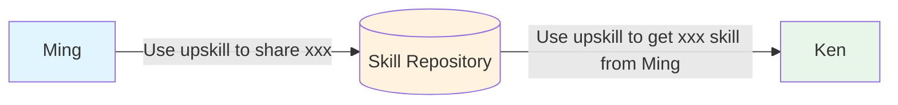
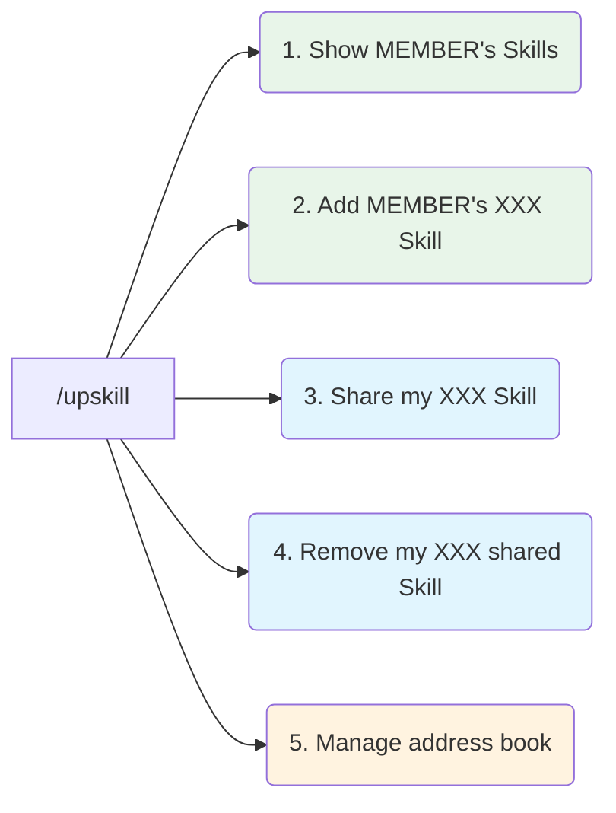

# Usage

## Simple



### Tell your LLM

#### Sender:

> Use upskill to share `<skill-name>` skill

#### Receiver:

> Use upskill to get `<skill-name>` from `<user-name>`

---

## Wizard Mode - the `/upskill` command



### Default - Shows options

> /upskill

```text
You can share or receive skills with members from the active address book:

Address Book: sandbox (3 members) - active
- leah (2), myles (0), ming (4)

---

What would you like to do?
1. Show a member's skills        - e.g. "show Andy's skills"
2. Add a member's skill          - e.g. "add Andy's say_hello skill"
3. Share your skill              - e.g. "share my xxx skill"
4. Remove a shared skill         - e.g. "remove my xxx skill"

To change address book, use option 5
5. Add or change address book    - e.g. "add an address book"
```

### 1. Show a member's skills

> Show ming's skills

```text
Choose what to add to your projects
1. core__coding__sh
2. core__diagram__flowchart
3. core__rule__make_concise
```

> 2

```text
Where would you like to add this?
1. skill_sandbox
2. your current project
3. specify a project path
```

> 1

```text
`core__diagram__flowchart` from `ming` has been added to `skill_sandbox`
```

### 2. Add a member's skills

> Add ming's core__coding__sh skill

```text
Where would you like to add this?
1. skill_sandbox
2. your current project
3. specify a project path
```

> 2

```text
`core__coding__sh` from `ming` has been added to this project
```

### 3. Share a skill

> Share my `core__rule__make_concise` skill

```text
`core__rule__make_concise` has been uploaded to `https://github.com/<github-username>/public-skills`
```

### 4. Remove a shared skill

> Remove my shared skill `core__rule__make_concise`

```text
`core__rule__make_concise` has been removed from `https://github.com/<github-username>/public-skills`
```
