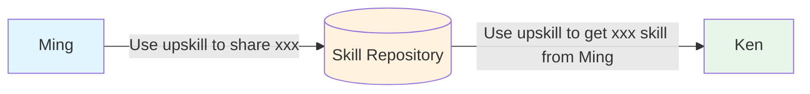
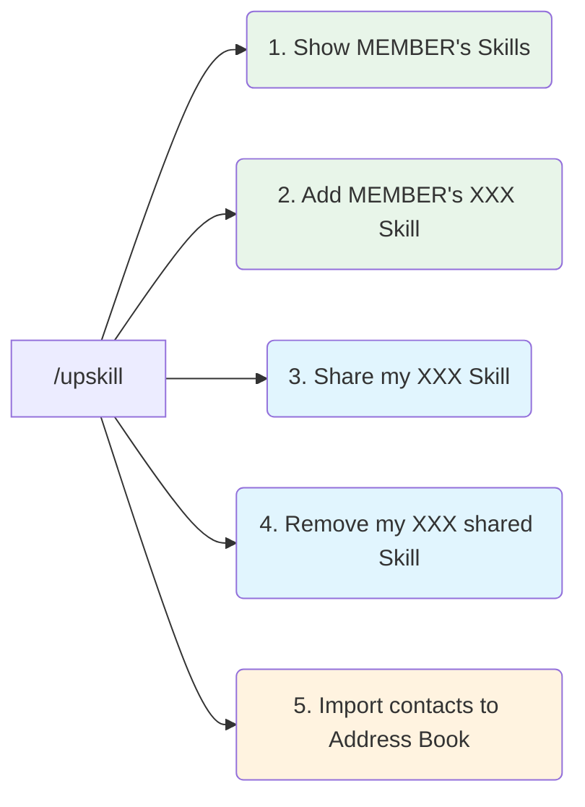

# Usage

## Simple



### Tell your LLM

#### Sender:

> Use upskill to share `<skill-name>` skill

#### Receiver:

> Use upskill to get `<skill-name>` from `<user-name>`

---

## Wizard Mode - the `/upskill` command



### Default - Shows options

> /upskill

```text
You can share or receive skills with members from the active address book:

Address Book: sandbox (3 members) - active
- leah, ming, myles

---

What would you like to do?
1. Show a member's skills        - e.g. "show Andy's skills"
2. Add a member's skill          - e.g. "add Andy's say_hello skill"
3. Share your skill              - e.g. "share my xxx skill"
4. Remove a shared skill         - e.g. "remove my xxx skill"

Manage address books:
5. Import contacts
```

Members are listed alphabetically. Nothing is downloaded to show this screen, so it is instant
however large the address book is. `- active` appears only when more than one address book is
installed.

### 1. Show a member's skills

> Show ming's skills

```text
Choose what to add to your projects
1. core__coding__sh
2. core__diagram__flowchart
3. core__rule__make_concise
```

> 2

```text
Where would you like to add this?
1. upskill__sandbox (Recommended)
2. your current project
3. specify a project path
```

> 1

```text
`core__diagram__flowchart` from `ming` has been added to `upskill__sandbox`
```

### 2. Add a member's skills

> Add ming's core__coding__sh skill

```text
Where would you like to add this?
1. upskill__sandbox (Recommended)
2. your current project
3. specify a project path
```

> 2

```text
`core__coding__sh` from `ming` has been added to this project
```

Adding a skill you already have replaces it, and says so:

```text
`core__coding__sh` from `ming` has been updated in this project
```

### 3. Share a skill

You say the name; upskill finds the folder. It can be in this project, in your `private_skills`,
or anywhere else you keep skills - a folder holding a `SKILL.md` is a skill.

> Share my `core__rule__make_concise` skill

```text
Found:
1. core__rule__make_concise
   /home/you/code/upskill__skills_lib/private_skills/core__base_skills/.claude/skills/core__rule__make_concise
```

When the name is close but not exact, or matches more than one folder, you are asked which:

```text
Which skill did you mean?
1. core__coding__sh
   /home/you/code/upskill__skills_lib/private_skills/core__base_skills/.claude/skills/core__coding__sh
2. coding__sh
   /home/you/code/upskill__skills_lib/public_skills/coding__sh
```

Then it is uploaded:

```text
`core__rule__make_concise` has been uploaded to `https://github.com/<github-username>/public_skills.git`
```

Anything carrying an api key, token or private key is refused before it is committed:

```text
BLOCKED: 1 possible secret(s) found

  /home/you/code/.../setup.py:1
      Anthropic API key  ->  sk-ant***

Nothing was committed or pushed.
```

### 4. Remove a shared skill

> Remove my shared skill

```text
Your shared skills - say which to remove
1. core__coding__sh
2. core__rule__make_concise
3. say_hello
```

> 2

```text
`core__rule__make_concise` has been removed from `https://github.com/<github-username>/public_skills.git`
```

Naming it directly works too:

> Remove my shared skill `core__rule__make_concise`

---

### 5. Import Contacts

> Import these people to my address book: https://github.com/mingzilla/upskill__setup/blob/main/address_books/address_book__sandbox.json

```text
Imported: leah, myles
Already in your address book: ming
```

People you already have are left exactly as they are - an import never changes where your existing
skills come from.
