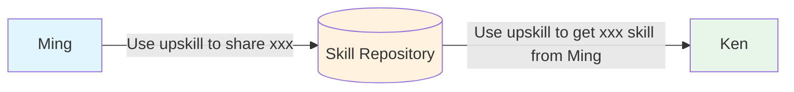

# Usage

```mermaid
flowchart LR
    U1[Ming]
    SR[(Skill Repository)]
    U2[Ken]
    U1 -->|Use upskill to share xxx| SR
    SR -->|Use upskill to get xxx skill from Ming| U2
    style U1 fill: #e1f5fe
    style SR fill: #fff3e0
    style U2 fill: #e8f5e9
```

### Tell your LLM

- **Sender**: Use upskill to share `<skill-name>` skill
- **Receiver**: Use upskill to get `<skill-name>` from `<user-name>`
